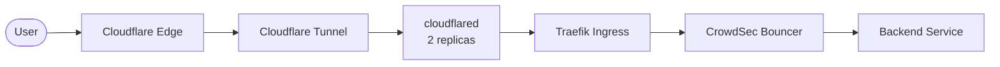

# Architecture

## Cluster

| Component | Detail |
|-----------|--------|
| Provider | DigitalOcean Kubernetes (DOKS) |
| Version | 1.35.1 |
| Nodes | 3× `s-4vcpu-8gb` (4 vCPU, 8 GB RAM each) |
| Region | nyc1 |
| CNI | Cilium with Hubble observability |

## Networking

- **Ingress**: Traefik (2 replicas) receiving traffic from Cloudflare Tunnel
- **Tunnel**: `cloudflared` (2 replicas) — outbound QUIC connection to Cloudflare Edge, no public IP or inbound ports needed
- **TLS**: Let's Encrypt wildcard certificate (`*.example.com`) via cert-manager + Cloudflare DNS-01 challenge
- **DNS**: Cloudflare — `*.example.com` CNAMEs point to the tunnel (no A records, origin IP hidden)
- **WAF**: CrowdSec bouncer integrated with Traefik for threat detection

## Storage

| Type | Backend | Use Case |
|------|---------|----------|
| Block Storage | DO Volumes (CSI) | Database PVCs, config persistence |
| Object Storage | DO Spaces via CSI-S3 | Media files, bulk data, backups |

## Traffic Flow

The request path:

1. **User** resolves `*.example.com` via Cloudflare DNS (CNAME to tunnel, no origin IP exposed)
2. **Cloudflare Edge** terminates the external TLS connection
3. **Cloudflare Tunnel** routes traffic over an outbound QUIC connection to `cloudflared` pods in-cluster — no public IP or inbound ports required
4. **cloudflared** (2 replicas) forwards the request to Traefik
5. **Traefik** applies routing rules and passes real client IPs via `X-Forwarded-For` (Cloudflare IPs in `trustedIPs`)
6. **CrowdSec** middleware checks the real client IP against ban lists
7. **Backend Service** receives the validated request

## Secrets Management

All secrets are encrypted with **Sealed Secrets** and stored in Git. The Sealed Secrets controller in-cluster decrypts them at apply time. No plaintext secrets exist in the repository.
